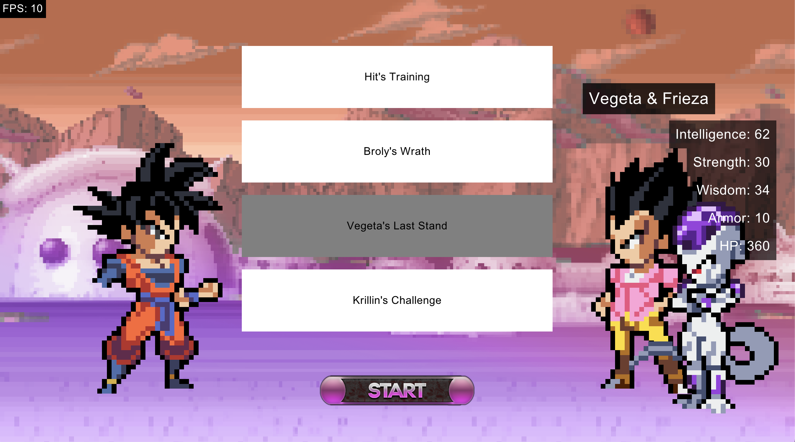

## What is a design pattern

A design pattern is a reusable solution to a common problem in software design. It provides a structured approach to solving issues that arise during development, promoting code maintainability and flexibility.

So in our case, in this project, we had to includes a lot of them.

## The basic Design Pattern to implements

### Singleton Pattern

In our case, the Singleton pattern is primarly used when we need to load data, so in that way, we ensure that the data is only loaded once and accessible everywhere

This is the code for the CharacterData Singleton for example.

```ruby
class CharacterData
    @instance = nil

    def self.instance
        @instance ||= new
    end

    attr_reader :data

    def initialize
        load_json
    end

    def refill_health_for_all_player
        @characters.each { |character| character.heal(99999999999999) }
    end

    def get_character(id)
        @characters.find { |character| character.id == id }
    end

    private def load_json
        file = File.read('./data/character.json')
        json_data = JSON.parse(file)
        @characters = json_data['data'].map do |char_data|
            char = CharacterDirector.create_character_from_json(char_data)
            DebugLog.info "SUCCESS : Successfully create character : #{char.id}"
            char
        end
    rescue Errno::ENOENT
        DebugLog.error "Le fichier JSON n'a pas été trouvé."
        @data = {}
    rescue JSON::ParserError => e
        DebugLog.error "Erreur de syntaxe dans le fichier JSON : #{e.message}"
        @data = {}
    end
end
```

### Factory Pattern 

In our case, the Factory Pattern is primary used for the UI, to create some button easily

```ruby
class ButtonFactory
  def initialize(window)
    @window = window
  end

  def create_button(x:, y:, width:, height:, text:, background_color:, hover_color:, text_color:, &callback)
    Button.new(@window, x, y, width, height, text, background_color, hover_color, text_color, &callback)
  end

  def create_training_button(x:, y:, width:, height:, training_name:, training_cost:, &callback)
    background_color = Gosu::Color::WHITE
    hover_color = Gosu::Color::GRAY
    text_color = Gosu::Color::BLACK

    TrainingButton.new(
      @window,
      x,
      y,
      width,
      height,
      training_name,
      training_cost,
      background_color,
      hover_color,
      text_color,
      &callback
    )
  end
  ...
end
```

With some modifications, this Factory can be very powerfull !

### Builder Pattern

As you also can see in the Factory, the Character uses the Builder Pattern to get build, in that way we can create really simply some character.

```ruby
class CharacterDirector
    def self.create_character_from_json(char_data)
        char_hp = 0
        begin
            if char_data['hp'] == nil
                raise "error"
            end
            char_hp = char_data['hp']
        rescue
            DebugLog.error("ERROR : Cannot get hp of the character : #{char_data['name']} ")
            char_hp = 100
        end

        if char_data['type'] == "normal"  
            character = NormalCharacter.new(char_data['name'], char_hp)
                                    .add_head(Part.new(char_data['full_body']))
                                    .add_body(Part.new(char_data['full_body']))
                                    .add_stats(CharacterStats.new(char_data['stats']['strength'], 
                                                                    char_data['stats']['intelligence'], 
                                                                    char_data['stats']['wisdom'],
                                                                    char_data['stats']['armor']))
        else 
            DebugLog.warning "ERROR : #{char_data['type']} isn't a valid type in character_factory.rb"
            return
        end

        char_data['attack'].each do |attack_data|
            attack_type = attack_data['type']
            if attack_type == 'strength'
                character.add_attack(StrengthAttack.new(attack_data['name'], 
                                                        attack_data['min'], 
                                                        attack_data['max']))
            elsif attack_type == 'intelligence'
                character.add_attack(IntelligenceAttack.new(attack_data['name'], 
                                                            attack_data['min'], 
                                                            attack_data['max']))
            else
                    DebugLog.warning "WARNING : attack type of #{attack_data["type"]} doesn't exist in character_factory.rb"
            end
        end
    
        character.set_id(char_data["id"])
    end
end
```

Beautiful ✨

### State Pattern

The main loop if the game is himself a State Pattern, like, scene management is state pattern, one scene can go to the other by updating the scene of the Game. So this is a good example of the state pattern !

```ruby
# Simplified code
class Game
    def initialize
      @current_scene = MainMenuScene.new(self)
    end
  
    def update
      @current_scene.update
    end
  
    def draw
      @current_scene.draw
    end
  
    def button_down(id)
      @current_scene.button_down(id)
    end
  
    def change_scene(scene)
      @current_scene = scene
    end
end

class MenuScene < Scene
  def initialize(game)
    @game = game
  end

  def update
   # update logics
  end

  def draw
    # draw code...
  end

  def button_down(id)
    if id == "enter"
        @game.change_scene(CreateCharacterScene.new(@game))
    end
  end
end
```

### Observer Pattern

For the Observer Pattern, I did a simple notifications//events management system like that

```ruby
class EventManager
  def initialize
    @observers = []
  end

  def add_observer(observer)
    @observers << observer
  end

  def remove_observer(observer)
    @observers.delete(observer)
  end

  def notify(event)
    @observers.each { |observer| observer.receive(event) }
  end
end

class TextDisplay < EventObserver
  ...

  def receive(new_text)
    @text = new_text
    @visible = true
    @time_displayed = Gosu::milliseconds / 1000.0
  end
end
```

### Decorator Pattern

In my case, the Decorator Pattern is used to decorate reward to add modifier to them

```ruby
class Reward
    attr_accessor :name, :description, :asset_path, :hover_asset_path

    def initialize(name = "Reward", ...)
        @name = name
        ...
    end

    def get_reward

    end
end
class StrengthReward < Reward
    def initialize(reward, amount)
        super("Strength #{reward.name}", ...)
        @reward = reward
        @amount = amount
    end

    def get_reward
        @reward.get_reward
        Player.instance.character.stats.strength += @amount
    end
end

class SenzuReward < Reward
    def initialize(reward)
        super("Senzu #{reward.name}", ...)
        @reward = reward
    end

    def get_reward
        @reward.get_reward
        Player.instance.character.hp = Player.instance.character.max_hp
    end
end
```

## The "advanced" Design Pattern to implements

### Command Pattern

Command Pattern is used for the Attack Option, the Player can have option for attacking, and they are using the Command Pattern.

```ruby
class AttackCommand
    def initialize(...)
        ...
    end

    def execute(launcher, opponent)
        DebugLog.warning "execute attack option"
    end
end

class IntelligenceAttack < AttackCommand 
    def execute(launcher, opponent)
        intelligence_multiplier = 1 + (launcher.stats.intelligence * 0.1)
        damage = rand(@min_attack..@max_attack) * intelligence_multiplier
        opponent.hit(damage)
        DebugLog.warning "#{launcher.name} used intelligence #{@name} on #{opponent.name} for #{damage} damage!"
    end
end
```

### Composite Pattern

The Composite Pattern is used to create some teams from character, it's usefull in our case !



```ruby
# This is the demonstration of the composite pattern.

class ZTeam < Character
    def initialize(name)
      super(name)
      @members = []
    end

    def add_member(character)
      @members << character
      return self
    end
  
    def remove_member(character)
      @members.delete(character)
      return self
    end
  
    def alive?
      @members.any?(&:alive?)
    end
  
    def random_attack(opponent)
      @members.each do |member|
        if member.alive?
          member.random_attack(opponent)
        end
      end
    end
  
    def hit(damage)
      damage_per_member = damage / @members.size.to_f
      @members.each do |member|
        member.hit(damage_per_member)
      end
    end
  
    def heal(heal_point)
      @members.each do |member|
        member.heal(heal_point)
      end
    end
  
    def draw_at(x, y, reversed = false, draw_health = true, desired_size = 128)
        offset_y = 0
        offset_x = 0
        @members.each do |member|
            member.draw_at(x + offset_x, y + offset_y, reversed, draw_health, desired_size)
            offset_y += 40
            offset_x += 100
        end
    end
  end
```

### Memento Pattern

With the rewards, I wanted that the player to reroll if he wants to get other rewards if he wants but also rollback to get the past rewards

So it's a classic and usefull Memento Pattern

```ruby
class RewardOriginator
  attr_accessor :state

  def initialize(state)
    @state = state
  end

  def save
    deep_copied_state = @state.map(&:deep_copy)
    RewardMemento.new(deep_copied_state)
  end

  def restore(memento)
    DebugLog.warning memento.state
    @state = memento.state
  end
end

class RewardCaretaker
  attr_accessor :mementos
  def initialize(originator)
    @mementos = []
    @originator = originator
  end

  def backup
    @mementos << @originator.save
  end

  def undo
    return if @mementos.empty?
    memento = @mementos.pop
    @originator.restore(memento)
  end

  def show_history
    @mementos.each { |memento| DebugLog.warning memento }
  end
end

class RewardMemento
  attr_reader :state
  attr_reader :date

  def initialize(state)
    @state = state
    @date = Time.now.strftime('%F %T')
  end
end
```

### Proxy Pattern

Proxy pattern is used when we wan't to tranformate to assure that every statistics is updated for the player

```ruby
class ProxyTransformation
    def initialize(state)
        @state = state
    end

    def activate
        raise "Default proxy transformation used, shouldn't"
    end
end

class SuperSayanProxy < ProxyTransformation
    def activate
        @state.character.updateState(SSJState.new(@state.character))
        @state.character.set_max_hp(500).heal(500)
        Player.instance.window.event_manager.notify("Character transformed in Super Sayan !")
    end
end
```

### Facade Pattern

Little bonus, my DebugLog use a facade to communicate with "puts" in an elegant way

```ruby
class DebugLog
    COLORS = {
      info: "\e[34m",    
      warning: "\e[33m", 
      error: "\e[31m",
      disclaimer: "\e[36m",
      reset: "\e[0m"    
    }
  
    def self.info(message)
      log(message, :info)
    end
  
    def self.warning(message)
      log(message, :warning)
    end
  
    def self.error(message)
      log(message, :error)
    end
  
    def self.log(message, level)
        timestamp = Time.now.strftime("%Y-%m-%d %H:%M:%S")
    
        if DEBUG_MODE == true
            puts "#{COLORS[level]}[#{timestamp}] #{message}#{COLORS[:reset]}"
        end
    end
end
```