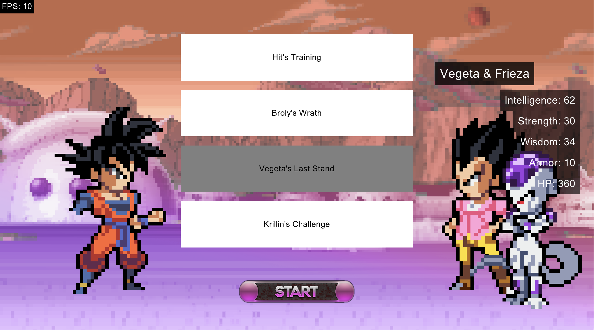
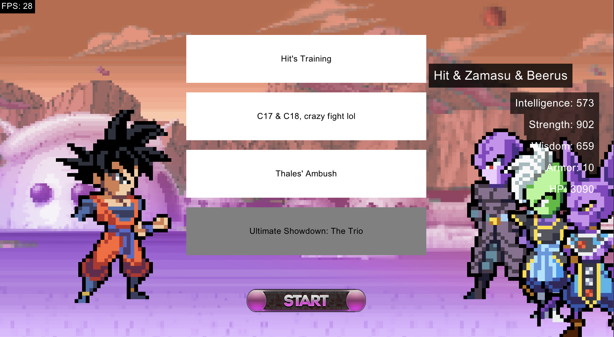

## Dragon Ball Omega Rogue


---

## Le Pitch

Créer un jeu vidéo sur le thème de Dragon Ball en utilisant des designs pattern avec quelques contraintes.

---

## De quoi on va parler

0. Le jeu
1. Le systeme de scene (State Pattern)

2. Le choix de personnage (Builder Pattern)
3. Le choix du niveau (Singleton & Factory Pattern)
4. Le combat (Command & Composite & Proxy Pattern)
5. Les récompenses (Decorator & Memento Pattern)
6. Système de notifications (Observer Pattern)
7. Debug Log (Facade Pattern)

<Alert message="Ceci est un message important!" />

---

## 0. Le jeu

---

### 0.1 - Ruby, Gosu

> Ruby est un langage de programmation orienté objet simple et efficace, sa syntaxe claire permet d'augmenter la productivité des développeurs.


> Gosu est une bibliothèque 2D pour créer des jeux vidéo simples et interactifs en Ruby.

---

### 0.2 - Un rogue like simple

> Ma boucle de jeu se concentre sur la création de personnage, entrainement, combat, et récompenses.


---

## 1. Le systeme de scene

> Le système de scènes basé sur le State Pattern encapsule chaque scène comme un état distinct, avec le moteur qui délègue l'exécution à la scène active pour des transitions fluides.

---

### 1.1 Un petit exemple de ma classe Game


> Petit exemple de la classe qui "hold" le state, dans cet exemple, MainMenuScene est mon state par défaut.

```ruby
class Game
    def initialize
      @current_scene = MainMenuScene.new(self)
    end
  
    def update
      @current_scene.update
    end
  
    def draw
      @current_scene.draw
    end
  
    def button_down(id)
      @current_scene.button_down(id)
    end
  
    def change_scene(scene)
      @current_scene = scene
    end
end
```
---

### 1.2 Un petit exemple de ma classe Scene


> La classe Scene qui represente donc un state de mon Game

```ruby
class MenuScene < Scene
  def initialize(game)
    @game = game
  end

  def update
   # update logics
  end

  def draw
    # draw code...
  end

  def button_down(id)
    if id == "enter"
        @game.change_scene(CreateCharacterScene.new(@game))
    end
  end
end

```

---

## 2. Le choix de personnage


---

### 2.1 Le build du personnage

> Exemple d'utilisation du build de mon personnage

```ruby
player_character
    .set_head(head)
    .set_body(body)
    .set_stats(CharacterStats.new(...))
    .add_attack(Attack.new("Fulguro Fist", ...))
    .add_attack(Attack.new("Kikoha", ...))
```

    

---

### 2.2 Le build du personnage

> Exemple d'utilisation du build de mon personnage plus poussé

```ruby
player_character
    .set_head(head)
    .set_body(body)
    .set_stats(CharacterStats.new(...))
    .add_attack(Attack.new("Fulguro Fist", ...))
    .add_attack(Attack.new("Kikoha", ...))
# Ce qui nous permet de rajouter une ligne optionnel qui va 
# radicalement changer le personnage afin de DEBUG
if DEBUG_MODE == true
    player_character
        .set_stats(CharacterStats.new(99999999, ...))
        .add_attack(IntelligenceAttack.new("JUST KILL", 60000, 30000000, ...))
        .add_attack(SuperSayanGodAttack.new())
        .add_attack(SuperSayanAttack.new())
end
```

---

## 3. Le choix du niveau


---

### 3.1 Le load des personnages à affronter et des niveaux

> Les niveaux et les personnages sont crées à partir de deux **gros json** qui sont ensuite load dans 2 singletons.

```ruby
class LevelData
    @instance = nil

    def self.instance
        @instance ||= new
    end

    def initialize
        load_json_levels
    end

    private def load_json_levels
        json_data = load_json('./data/levels.json')
        @levels = json_data['data'].map do |level_data|
            level = LevelFactory.create_level_from_json(level_data)
        end
    end
end

```

---

### 3.2 Les factorys !

> Dans ces factory, il se passe un tas de trucs en fonction du niveau.

```ruby
class LevelFactory
	def self.create_level_from_json(level_data)
		RewardFactory.get_reward(level_data["reward"], level_data["title"])
        character = CharacterData.instance.get_character(level_data['character'])
        Level.new(level_data["title"], level_data["description"], character, level_data["difficulty"], level_data["reward"])
	end
end 
```

--- 

### 3.3 Pourquoi c'est nécessaire ?

> Pour faciliter l'ajout de nouveaux niveaux, j'ai choisi d'opter pour une structure data driven, et ça commence par la création de personnages et de niveaux.

```json
// Exemple de création de personnage
{
    "id": "c17",
    "hp": 40,
    "type": "normal",
    "name": "C17",
    "full_body": "./assets/parts/full/c17.png",
    "stats": {...},
    "attack":[...]
}
// Exemple de création de niveau
{
    "id": "kill_c17",
    "title": "Kill C17",
    "description": "kill him pleaze.",
    "difficulty": "easy",
    "character": "c17", // The id of the chracter
    "reward": [
        { "decor": [{"name": "senzu"}, {"name": "training_point", "amount": 24}, {"name": "ssjgod_reward"}] },
        ...
    ] // The different possible rewards
}
```

---

## 4. Le combat


---

### 4.1 - Les compétences

> Les compétences utilisent le Command Pattern visant a encapsuler et parametrer des actions, dans notre cas, des attaques.

```ruby
class AbilityCommand 
    def execute(launcher, opponent)
        raise "execute isn't implemented"
    end
end

class IntelligenceAttack < AbilityCommand 
    def execute(launcher, opponent)
        damage = rand(@min_attack..@max_attack) * intelligence_multiplier
        opponent.hit(damage)
    end
end

class SuperSayanTransformation < AbilityCommand 
    def execute(launcher, opponent)
      launcher.awakenToSSJ()
    end
end
```

---

### 4.2 - Les équipes ✨


<div class="flex" style="gap:4vw">

<div style="width: 40%;">

> Le composite pattern me permet dans ce cas précis de créer des équipes de character sans avoir à repenser à toute ma logique de combat. ✨

</div>

```ruby
class Character
  def draw
    ...
  end

  def hit(damage)
    ...
  end 

  def heal(heal_point)
    ...
  end
end

class ZTeam < Character
    def initialize
      @members = []
    end
  
    def add_member(character)
      @members << character
      return self
    end

    def draw()
        @members.each do |member|
            member.draw
        end
    end
  
    def hit(damage)
      damage_per_member = damage / @members.size.to_f
      @members.each do |member|
        member.hit(damage_per_member)
      end
    end
  
    def heal(heal_point)
      @members.each do |member|
        member.heal(heal_point)
      end
    end
end  
```

</div>

---

### 4.2 - Les équipes ✨

> Ce qui peut donner naissance à des combats de ce genre 

<div class="flex">





</div>


---

### 4.3 - La transformation en SSJ

> La transformation en SSJ, se fait par le biais d'un proxy qui va nous permettre d'effectuer quelques actions avant de passer réellement en SSJ

```ruby
class ProxyTransformation
    def initialize(new_state)
        @new_state = new_state
    end

    def activate
        raise "Default proxy transformation used, shouldn't"
    end
end

class SuperSayanProxy < ProxyTransformation
    def activate
        # The other action for exemple
        @new_state.character.set_max_hp(500).heal(500)
        # The main action
        @new_state.character.updateState(SSJState.new(@new_state.character))
    end
end
```

---

## 5. Les récompenses


---

### 5.1 - Décoration des récompenses

```ruby
reward_instance = Reward.new()
reward_instance = IntelligenceReward.new(reward_instance, amount)
reward_instance = StrengthReward.new(reward_instance, amount)
reward_instance = TrainingReward.new(reward_instance, AttackTraining.new("Canon Garic" ...))
reward_instance = TrainingReward.new(reward_instance, AttackTraining.new("Genkidama" ...))
```

---

### 5.2 - L'utilisation du Memento 

> Utiliser un memento dans ce genre de jeu peut se réveler quelque peu compliqué par moment, dans mon cas, j'ai décidé de l'utiliser dans les rewards afin de proposer au joueur de "reroll" ses rewards si elles ne lui conviennent pas.

```ruby
class RewardOriginator
  def initialize(state)
    @state = state
  end

  def save
    deep_copied_state = @state.map(&:deep_copy)
    RewardMemento.new(deep_copied_state)
  end

  def restore(memento)
    @state = memento.state
  end
end

class RewardCaretaker
  def initialize(originator)
    @mementos = []
    @originator = originator
  end

  def backup
    @mementos << @originator.save
  end

  def undo
    return if @mementos.empty?
    memento = @mementos.pop
    @originator.restore(memento)
  end
end

class RewardMemento
  attr_reader :state

  def initialize(state)
    @state = state
  end
end
```

---

## 6. Système de notifications

---

### 6.1 - Utilisation de l'observer

> Dans mon cas, le systeme de notifications est un simple Events Manager avec un Text Display en observer qui écoute les events envoyés par le jeu.

```ruby
# L'objet qui va gérer et renvoyer les evenements à l'observer
class EventManager
    def initialize
        @observers = []
    end

    def add_observer(observer)
        @observers << observer
    end

    def remove_observer(observer)
        @observers.delete(observer)
    end

    def notify(event)
        @observers.each { |observer| observer.receive(event) }
    end
end

class Observer
    def receive(event)

    end
end

class TextDisplay < Observer
    def receive(event)
        @text = event.text
    end
end
```

---

## 7. Le Debug

---

### 7.1 - Utilisation de la façade

> En petit bonus, j'ai décidé d'implémenter la façade pour pouvoir utilisé plus facilement de manière différente la fonction puts qui permet de logger en Ruby ! Et encore mieux, grâce à cette fçade, je peux facilement retirer tout les logs de mon jeu avec une simple condition par exemple !

```ruby
class DebugLog
    def self.info(message)
      log(message, :info)
    end
  
    def self.warning(message)
      log(message, :warning)
    end
  
    def self.error(message)
      log(message, :error)
    end
  
    def self.log(message, level)
        if DEBUG_MODE == true
            timestamp = Time.now.strftime("%Y-%m-%d %H:%M:%S")
            puts "#{COLORS[level]}[#{timestamp}] #{message}#{COLORS[:reset]}"
        end
    end
  end
```

---

## Conclusion

---

### Les Design Pattern non adaptés aux jeux vidéos

<br>

#### Le Singleton Abusif

> Abusé du Singleton peut amené à un code moins rigide et un surplus de dépendances.

<br>

#### Le Pattern de l'observer

> Bien qu'utile pour un système de notifications par exemples, le pattern de l'observer peut mené à des surcouts en performance.

---

### Merci d'avoir ecouté

