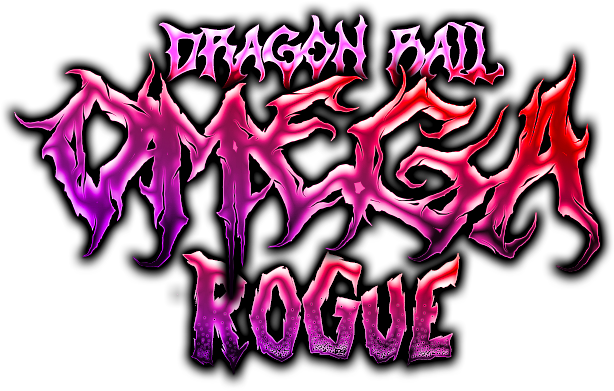
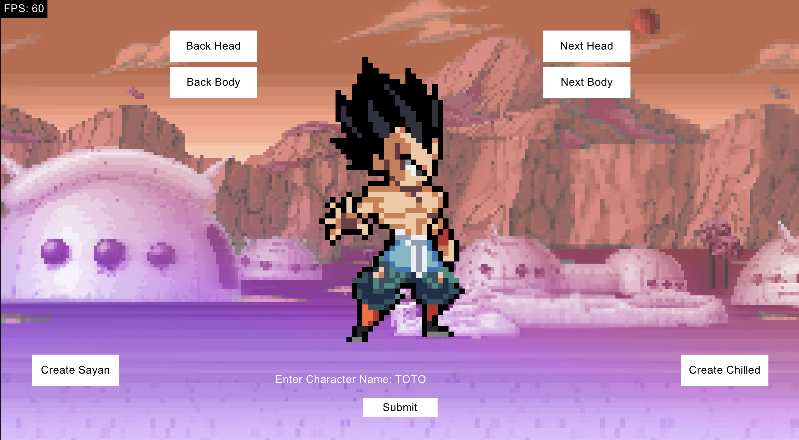
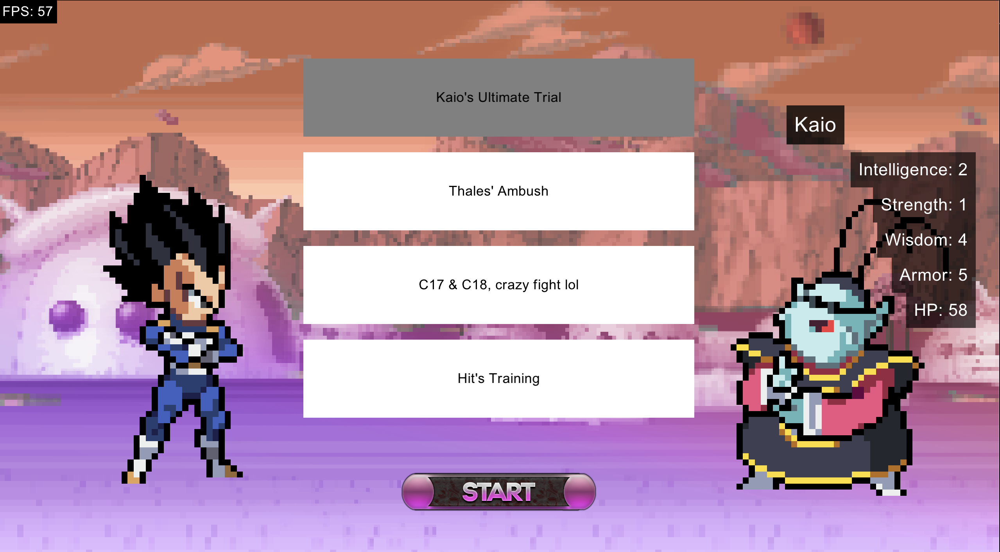
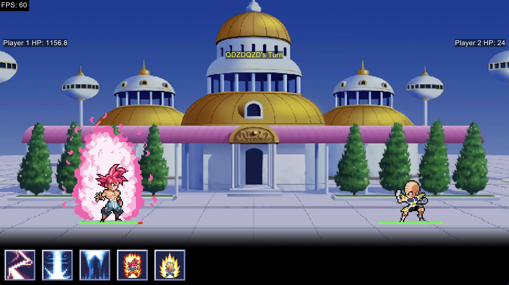

## Dragon Ball Omega Rogue




---

## Le Pitch

Créer un jeu vidéo sur le thème de Dragon Ball en utilisant des designs pattern avec quelques contraintes.

---

## De quoi on va parler

1. Le systeme de scene (State Pattern)

2. Le choix de personnage (Builder Pattern)
3. Le choix du niveau (Singleton & Factory Pattern)
4. Le combat (Command & Composite & Proxy Pattern)
5. Les récompenses (Decorator & Memento Pattern)
6. Système de notifications (Observer Pattern)
7. Debug Log (Facade Pattern)

<Alert message="Ceci est un message important!" />

---

## 1. Le systeme de scene

> Le système de scènes basé sur le State Pattern encapsule chaque scène comme un état distinct, avec le moteur qui délègue l'exécution à la scène active pour des transitions fluides.

---

## 1.1 Un petit exemple de ma classe Game


> Petit exemple de la classe qui "hold" le state, dans cet exemple, MainMenuScene est mon state par défaut.

```ruby
class Game
    def initialize
      @current_scene = MainMenuScene.new(self)
    end
  
    def update
      @current_scene.update
    end
  
    def draw
      @current_scene.draw
    end
  
    def button_down(id)
      @current_scene.button_down(id)
    end
  
    def change_scene(scene)
      @current_scene = scene
    end
end
```
---

## 1.2 Un petit exemple de ma classe Scene


> La classe Scene qui represente donc un state de mon Game

```ruby
class MenuScene < Scene
  def initialize(game)
    @game = game
  end

  def update
   # update logics
  end

  def draw
    # draw code...
  end

  def button_down(id)
    if id == "enter"
        @game.change_scene(CreateCharacterScene.new(@game))
    end
  end
end

```

---

## 2 Le choix de personnage



---

## 2.1 Le build du personnage

> Exemple d'utilisation du build de mon personnage

```ruby
player_character
      .set_head(head)
      .set_body(body)
      .set_stats(CharacterStats.new(...))
      .add_attack(Attack.new("Fulguro Fist", ...))
      .add_attack(Attack.new("Kikoha", ...))
```
---

## 2.2 Le build du personnage

> Exemple d'utilisation du build de mon personnage plus poussé

```ruby
player_character
    .set_head(head)
    .set_body(body)
    .set_stats(CharacterStats.new(...))
    .add_attack(Attack.new("Fulguro Fist", ...))
    .add_attack(Attack.new("Kikoha", ...))
# Ce qui nous permet de rajouter une ligne optionnel qui va 
# radicalement changer le personnage afin de DEBUG
if DEBUG_MODE == true
    player_character
        .set_stats(CharacterStats.new(99999999, ...))
        .add_attack(IntelligenceAttack.new("JUST KILL", 60000, 30000000, ...))
        .add_attack(SuperSayanGodAttack.new())
        .add_attack(SuperSayanAttack.new())
end
```

---

## 3 Le choix du niveau



---

## 3.1 Le load des personnages à affronter et des niveaux

> Les niveaux et les personnages sont crées à partir de deux **gros json** qui sont ensuite load dans 2 singletons.

```ruby
class LevelData
    @instance = nil

    def self.instance
        @instance ||= new
    end

    def initialize
        load_json_levels
    end

    private def load_json_levels
        json_data = load_json('./data/levels.json')
        @levels = json_data['data'].map do |level_data|
            level = LevelFactory.create_level_from_json(level_data)
        end
    end
end

```

---

## 3.2 Les factorys !

> Dans ces factory, il se passe un tas de trucs en fonction du niveau.

```ruby
class LevelFactory
	def self.create_level_from_json(level_data)
		RewardFactory.get_reward(level_data["reward"], level_data["title"])
        character = CharacterData.instance.get_character(level_data['character'])
        Level.new(level_data["title"], level_data["description"], character, level_data["difficulty"], level_data["reward"])
	end
end 
```

--- 

## 3.3 Pourquoi c'est nécessaire ?

> Pour faciliter l'ajout de nouveau niveau, j'ai choisi d'opter pour une structure data driven, et ça commence par la création de personnages et de niveaux.

```json
// Exemple de création de personnage
{
    "id": "c17",
    "hp": 40,
    "type": "normal",
    "name": "C17",
    "full_body": "./assets/parts/full/c17.png",
    "stats": {...},
    "attack":[...]
}
// Exemple de création de niveau
{
    "id": "kill_c17",
    "title": "Kill C17",
    "description": "kill him pleaze.",
    "difficulty": "easy",
    "character": "c17", // The id of the chracter
    "reward": [
        { "decor": [{"name": "senzu"}, {"name": "training_point", "amount": 24}, {"name": "ssjgod_reward"}] },
        ...
    ] // The different possible rewards
}
```

---

### 4 Le combat



---

### 4.1 - Les compétences

> Les compétences utilisent le Command Pattern visant a encapsuler et parametrer des actions, dans notre cas, des attaques.

```ruby
class AbilityCommand 
    def execute(launcher, opponent)
        raise "execute isn't implemented"
    end
end

class IntelligenceAttack < AbilityCommand 
    def execute(launcher, opponent)
        damage = rand(@min_attack..@max_attack) * intelligence_multiplier
        opponent.hit(damage)
    end
end

class SuperSayanTransformation < AbilityCommand 
    def execute(launcher, opponent)
      launcher.awakenToSSJ()
    end
end
```

---

### 4.2 - Les équipes ✨

> Il est possible de se battre contre une équipe de character ! Le Composite Pattern nous permet, d'une facon élégante, de créer un Character (Z-Team) composé d'autres Character, magnifique !

```ruby
class Character
  def draw
    ...
  end

  def hit(damage)
    ...
  end 

  def heal(heal_point)
    ...
  end
end

class ZTeam < Character
    def initialize
      @members = []
    end
  
    def add_member(character)
      @members << character
      return self
    end

    def draw()
        @members.each do |member|
            member.draw
        end
    end
  
    def hit(damage)
      damage_per_member = damage / @members.size.to_f
      @members.each do |member|
        member.hit(damage_per_member)
      end
    end
  
    def heal(heal_point)
      @members.each do |member|
        member.heal(heal_point)
      end
    end
end  
```